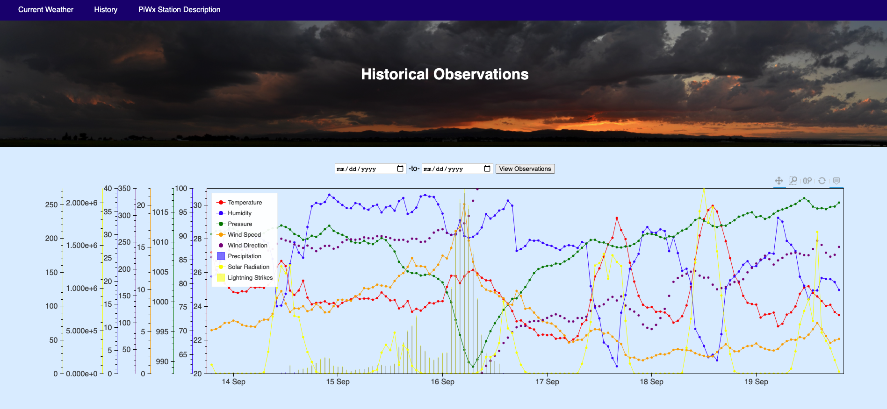

This is a Flask-Bokeh data visualization project in Python designed for data collected with a custom-built weather station (code available at https://www.github.com/cdens/wxcode).

A running version of this web server is available at https://densmorewx.pythonanywhere.com

